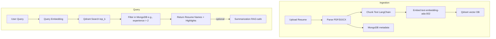
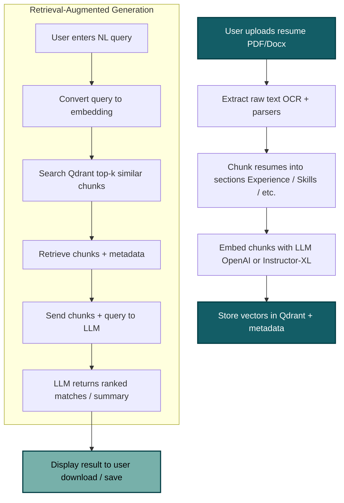

# 📄 Resume Search Assistant — End-to-End Technical Documentation (RAG, Qdrant, MongoDB)

## Overview

This system is a **Resume Search Assistant** built using **Retrieval-Augmented Generation (RAG)**. It supports **semantic search over resumes** using **OpenAI embeddings (`text-embedding-ada-002`)**, a **vector store (Qdrant)** for fast similarity search, and **MongoDB** for structured metadata. It is designed to be **accurate, scalable, hallucination-free**, and supports **both batch and dynamic resume ingestion**.

---

## Goals

| Objective           | Description                                                                                                 |
| ------------------- | ----------------------------------------------------------------------------------------------------------- |
| Semantic Search     | Allow users to search resumes using natural language (e.g. "Python developer with 2+ years of experience"). |
| Hallucination-Free  | Only show results grounded in actual resume content or metadata.                                            |
| Real-Time Ingestion | Support single or batch resume uploads (PDF/DOCX).                                                          |
| Resume Updates      | Allow upserts: replace vector + metadata when re-uploaded.                                                  |
| Scalability         | Handle 1000+ resumes and scale to millions.                                                                 |

---

## High-Level Architecture



---

## Data Flow Breakdown

### Ingestion Pipeline (Single / Batch Upload)

1. **Upload file** via FastAPI.
2. **Parse** content using pdfminer (PDF) or python-docx (DOCX).
3. **Chunk** content using LangChain's `RecursiveCharacterTextSplitter`.
4. **Embed** each chunk using OpenAI's `text-embedding-ada-002`.
5. **Store**:

   * Chunks + vectors → Qdrant
   * Resume metadata (name, email, skills, exp, resume\_id) → MongoDB

### Resume Update (Upsert Flow)

1. Compute deterministic `resume_id`.
2. Delete all chunks in Qdrant where `payload.resume_id == resume_id`.
3. Replace metadata in MongoDB.
4. Re-run embedding and store new chunks.

### Query Flow

1. User enters natural-language query.
2. Embed query using `text-embedding-ada-002`.
3. Search Qdrant with `top_k` (e.g., 100–500).
4. Deduplicate by `resume_id`.
5. Apply metadata filters (e.g. `skills: "python"`, `years_experience > 2`).
6. Return matching resume names (and optionally RAG-safe LLM summary).

---

## Storage Design

### Qdrant (Vector DB)

* Stores: `vector`, `payload.resume_id`, `payload.text`, `payload.skills`, etc.
* Supports: fast similarity search, payload filters, bulk upsert & delete.
* Typical: one resume = 10–20 vector chunks.

### MongoDB (Metadata)

* Stores structured metadata per resume:

```json
{
  "resume_id": "abc123",
  "name": "John Doe",
  "skills": ["python", "django"],
  "years_experience": 3,
  "version": 2
}
```

* Indexed on `skills`, `years_experience`, `resume_id` for fast filtering.

---

## Handling Large Retrieval (Top-K)

| Scenario       | Result                                    |
| -------------- | ----------------------------------------- |
| `top_k = 100`  | \~10–30 unique resumes                    |
| `top_k = 500`  | \~50–150 resumes                          |
| `top_k = 5000` | May cover all, but slow, noisy, expensive |
 
> Using **MongoDB filters or hybrid search** to guarantee full coverage (e.g., all 400 resumes with Python).

<details>
<summary>🔍 What does "Use MongoDB filters or hybrid search to guarantee full coverage" mean?</summary>

When  searching for resumes that contain a specific skill like **"Python"**, here's how the system can ensure you find **all matching resumes** (not just a few similar ones):

---

### ✅ Option 1: MongoDB Filter (Structured Search)

If we saved resume data like this in MongoDB:

```json
{
  "resume_id": "123",
  "skills": ["python", "flask"],
  "years_experience": 3
}
```

we can write a **fast query** to find all resumes with Python:

```python
resumes = mongodb.find({"skills": "python"})
```

* ✅ Returns all matches
* ⚡ Fast and exact

---

### ✅ Option 2: Hybrid Search (Vector + Filter)

Instead of using just similarity (Qdrant) or just filters (Mongo), combine both:

```python
results = qdrant.search(
  vector=query_embedding,
  top_k=1000,
  filter={"must": [{"key": "skills", "match": {"value": "python"}}]}
)
```

This:

* Embeds your query into a smart number
* Finds similar chunks **only** from resumes that have "python" listed

---

### ❌ Why Not Just Vector Search with Big `top_k`?

* `top_k = 1000` doesn’t **guarantee** full coverage
* Might miss low-ranked but relevant resumes
* Slower, more memory use
* Hard to clean up duplicates

---

### 🧠 Best Practice

Use:

* **MongoDB filters** to get all resume\_ids with a skill
* Then get their chunks from Qdrant to score, rank, or display

This way, you get:

* 💯 Full coverage
* ⚡ Fast results
* 🎯 Relevant matches

</details>


### Why Not Only `top_k = all`?

* Expensive and slow
* Returns irrelevant chunks
* Increases memory usage and API latency
* Harder to deduplicate

---

## Hybrid Search Strategy (Recommended)

1. Step 1 — Structured filter from MongoDB:

```python
resume_ids = mongodb.find({"skills": "python"})
```

2. Step 2 — For each `resume_id`, get vectors from Qdrant.
3. Step 3 — Score/rank as needed and return resume names.


---

## API Summary

| Endpoint  | Method | Purpose                     |
| --------- | ------ | --------------------------- |
| `/upload` | POST   | Upload PDF/DOCX resume      |
| `/search` | GET    | Search via natural language |
| `/upsert` | POST   | Re-upload + replace resume  |

---

## Tools & Tech Stack

| Component          | Tool                                         |
| ------------------ | -------------------------------------------- |
| Backend APIs       | FastAPI (Python)                             |
| Embedding Model    | OpenAI `text-embedding-ada-002`              |
| Vector Store       | Qdrant                                       |
| Metadata DB        | MongoDB                                      |
| Chunking           | LangChain                                    |
| File Parsing       | pdfminer.six, python-docx                    |
| Optional LLM (RAG) | GPT-4 / GPT-3.5 (with strict context limits) |

---

## Conclusion

* Ingest hundreds of resumes
* Search with natural language
* Get grounded, trustworthy matches
* Handle upserts and dynamic updates
* Extend easily with hybrid or keyword search

---

## Single and Batch injection

---